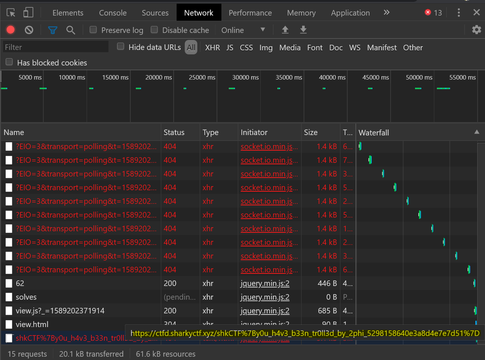
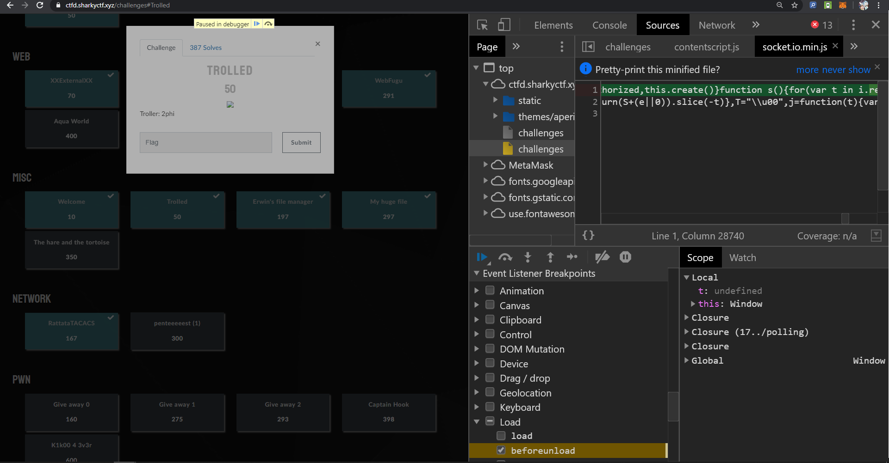
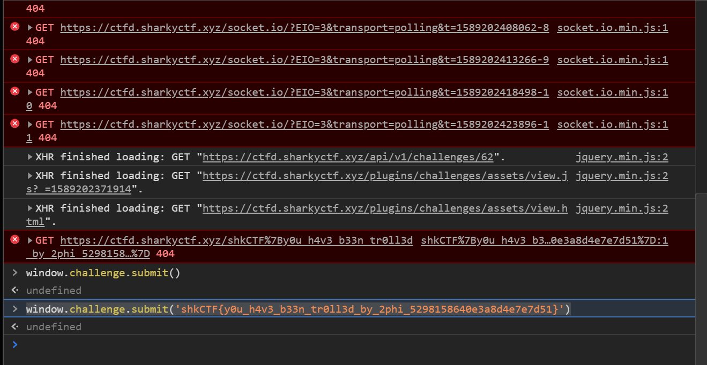

# Problem Statement

Trolled
Troller: 2phi

# Solution

Try to open the challenge screen to get your briefing, and it immediately closes. It does make a network call before it closes, giving us the flag.

Now what?

After some research, it seems that closing the challenge popup is not a clsoe, it's a relocate, which has to do with an image that was part of the flag. That it also has an "onerror" bound to a change location to "/". I tried removing the DOM element at the right time, tried setting better breakpoints, etc. I've tried posting to the solve api after researching the api and getting the challengeid (62). That did not work. Nothing worked.

It took some careful maneuvering of the Chrome DevTools to do this, with no visual feedback , and it all had to do with setting the right breakpoint:

And then, it may have been something like this (I have to confirm with my teammate as I do not remember):

