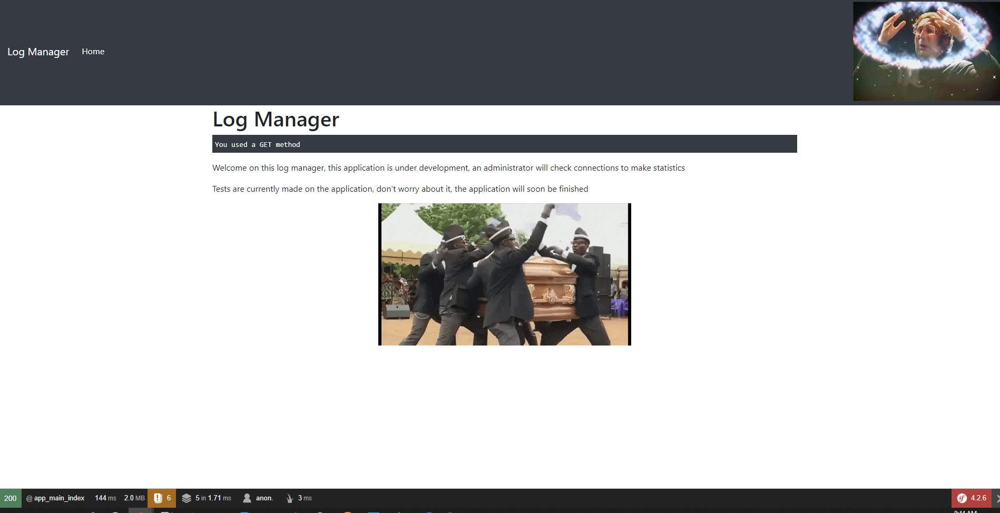
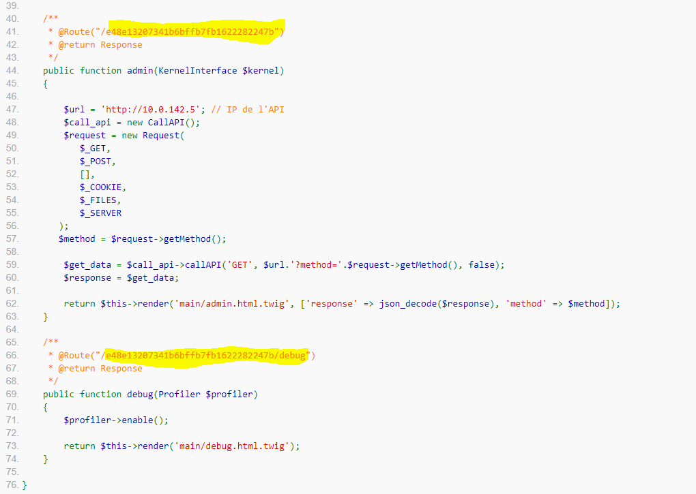
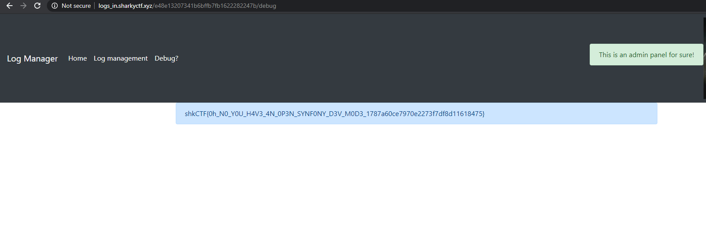

# Problem Statement

Data printed on one of our dev application has been altered, after questioning the team responsible of its development, it doesn't seem to be their doing. The H4XX0R that changed the front seems to be a meme fan and enjoyed setting the front.

We've already closed the RCE he used, there is a sensitive database running behind it. If anyone could access it we'll be in trouble. Can you please audit this version of the application and tell us if you find anything compromising, you shouldn't be able to find the admin session.

The application is hosted at logs_in

Creator : Remsio

# Analysis

This was really a weird one, a bit on the easy side. The first thing I noticed was the bar at the bottom. 

Clicking "the first button" in the bar, I got to a debug page. After some clicking around, Clicking on MainController::index in the Request/Response screen revealed some routes:

Navigating to http://logs_in.sharkyctf.xyz/e48e13207341b6bffb7fb1622282247b/debug, we get the win screen with the flag.

# Flag
shkCTF{0h_N0_Y0U_H4V3_4N_0P3N_SYNF0NY_D3V_M0D3_1787a60ce7970e2273f7df8d11618475}
