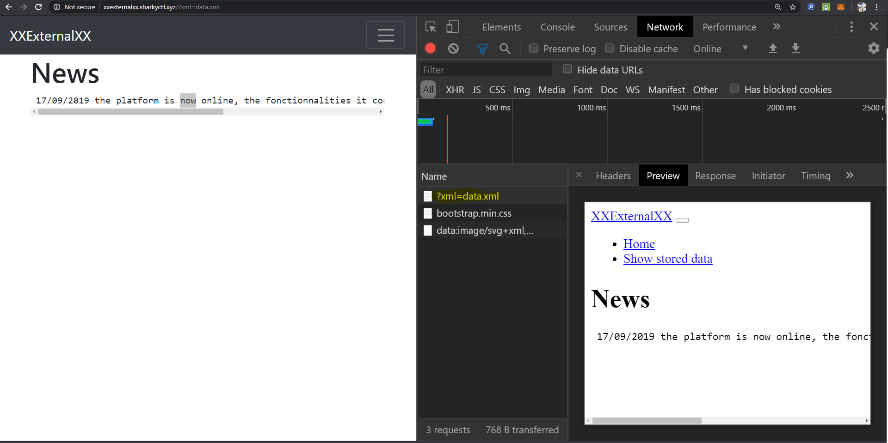
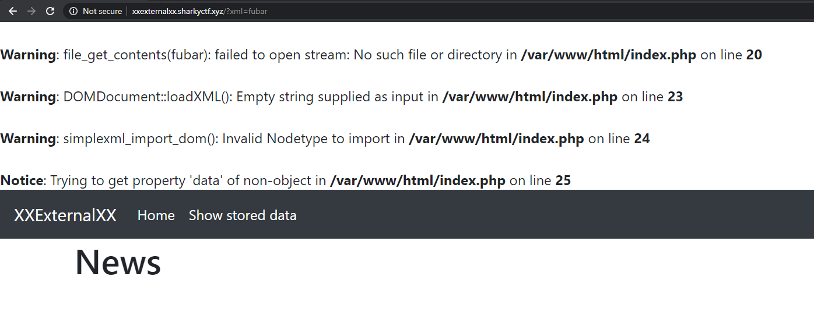
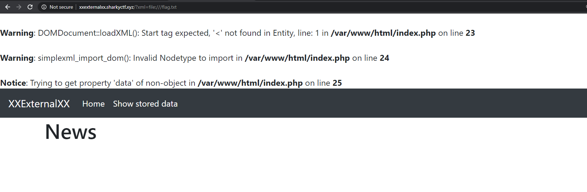
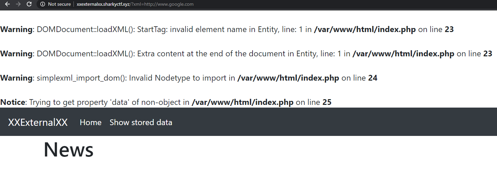
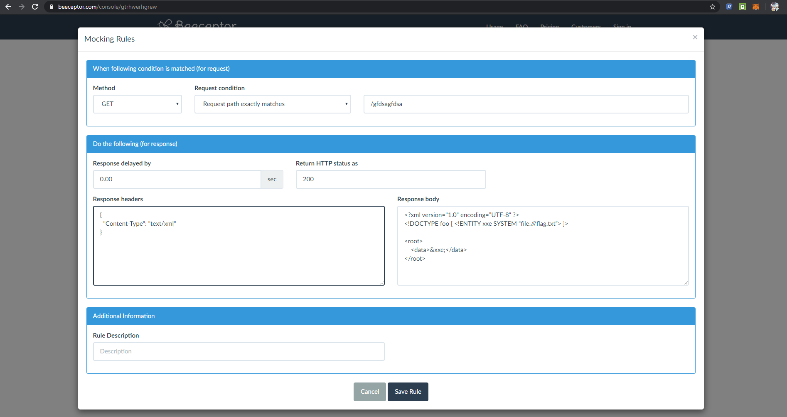
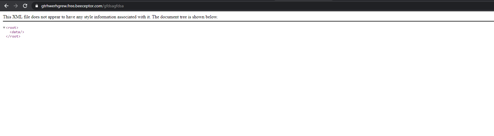
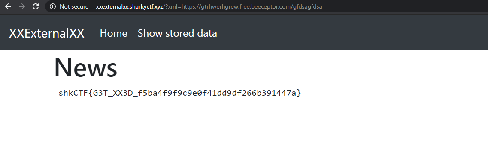

# Problem Statement

One of your customer all proud of his new platform asked you to audit it. To show him that you can get information on his server, he hid a file "flag.txt" at the server's root.

xxexternalxx.sharkyctf.xyz

Creator : Remsio

# Solution

Hmm, no input forms, intriguing. The challenge mentions XXE, so there must be an "in'. Let's recon. Chrome Dev Tools or the equivalent for your browser and something like fiddler/postman/burp are your friends on this kind of challenge! 

Clicking around, something interesting happes when clicking "Show Stored Data" Hmm what is this?

An xml file. I wonder what it contains. Maybe we get lucky accessing http://xxexternalxx.sharkyctf.xyz/data.xml. A beautiful, glorious xml shows itself:

    <root>
        <data>
            17/09/2019 the platform is now online, the fonctionnalities it contains will be audited by one of our society partenairs
        </data>
    </root>
    
So the news content is displayed from this xml. Interesting choice. Let's try something stupid, let's put something invalid in that link:

Oh boy! Fubar is right. it's actually attempting to find our input, and it fails, giving us an error.

Diagnostics time, what we can figure from the error:
* The error happens when trying to open a file called fubar (not before). So command injection does not seem plausible
* There is some mention loadXml(). Pathing to flag.txt seems useless, since that xmlLoad would probably fail
* Can we get a different errorr?

Ok let's try to path to the flag (http://xxexternalxx.sharkyctf.xyz/?xml=file:///flag.txt).

Oh wow, no more not-found. However, the loadXml function fails, as expected. But this is not entirely useless. That absolute path got me thinking of other absolutes, a terrible but maybe working idea :) A dream of http/https. Let's try (http://xxexternalxx.sharkyctf.xyz/?xml=http://www.google.com) :)

Gloprious successful failure. Alright, based on the error being with loadXml, I think we have an in. If we could get the server to render the flag through a malicious XML. Time to use our best friend, Google to see what this XXE thing is about :)  Reading different sources, I stumbled upon https://medium.com/@onehackman/exploiting-xml-external-entity-xxe-injections-b0e3eac388f9 which contained the clearest and most comprehensive guide on XXE (yes, better than OWASP). On the site, some clear eye opening payload:

    <?xml version="1.0" encoding=”UTF-8" ?>
    <!DOCTYPE foo [ <!ENTITY xxe SYSTEM “file:///etc/passwd”> ]>
    <stockCheck><productId>&xxe;</productId></stockCheck>
    
With minor tweaks based on the data.xml contents we already have, I think we have our payload

    <?xml version="1.0" encoding="UTF-8" ?>
    <!DOCTYPE foo [ <!ENTITY xxe SYSTEM "file:///flag.txt"> ]>
    <root>
        <data>&xxe;</data>
    </root>

Now for matter of style: how to deliver the payload? Many techniques could be used. I chose Beeceptor only because MockBin wich does have a friendliert interface did not work for me for some reason. There are many other techniques you can apply.

Finally, we get the payload to be served through a public API:

No flag.txt on their service :) Time for the moment of truth, let's try to delegate some work to the victim site:

We wooon!

# Flag
shkCTF{G3T_XX3D_f5ba4f9f9c9e0f41dd9df266b391447a}

